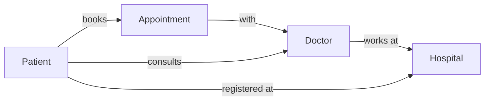

# Conceptual Design (Initial)

> Initial idea only. It will be refined in Review 2.

## Entity Relationships (Graph view)

## Where Each Structure Could Fit
- **Trees (BST / AVL):** store and search patient and doctor records by ID.
- **Graph:** represent how patients, doctors, hospitals and appointments are connected (one patient to many doctors, one doctor to many patients).
- **Heap:** order urgent appointments by priority.
