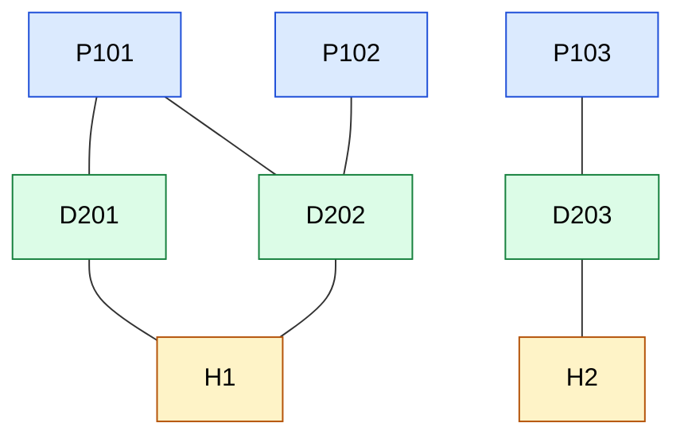

# Graph Design

This document describes the graph used to represent patient-doctor-hospital relationships. The example below is the same dummy data built in `src/demo.py`, and it is implemented in `src/graph.py`.

## Nodes and edges

| Node type | Example | Meaning |
|---|---|---|
| Patient | `P101` | A registered patient |
| Doctor | `D201` | A doctor |
| Hospital | `H1` | A hospital or clinic |

| Edge | Meaning |
|---|---|
| Patient - Doctor | The patient has consulted the doctor |
| Doctor - Hospital | The doctor works at the hospital |

Edges are undirected, so a connection can be followed in both directions.

## Diagram



Blue = patients, green = doctors, yellow = hospitals.

## Adjacency list

The graph is stored as a dictionary that maps each node to the list of its neighbours.

```
P101: [D201, D202]
P102: [D202]
P103: [D203]
D201: [P101, H1]
D202: [P101, P102, H1]
D203: [P103, H2]
H1:   [D201, D202]
H2:   [D203]
```

An adjacency list is used because each node has only a few neighbours (sparse graph). It needs O(V + E) space, while an adjacency matrix would need O(V²).

## Traversals from P101

| Traversal | Technique | Visit order |
|---|---|---|
| BFS | Queue, level by level | P101, D201, D202, H1, P102 |
| DFS | Stack, deep first | P101, D201, H1, D202, P102 |

**BFS levels:**
- Level 0: P101
- Level 1: D201, D202 (doctors the patient has consulted)
- Level 2: H1, P102 (the hospital they work at, and another patient of D202)

Both traversals keep a visited set so that no node is processed twice. Both take O(V + E).

## Uses in the platform

- Find the doctors and hospitals connected to a patient (`reachable_of_kind` in `graph.py`).
- Find which other patients are linked to the same doctor.
- Planned: recommend a doctor using the connections in the graph.
